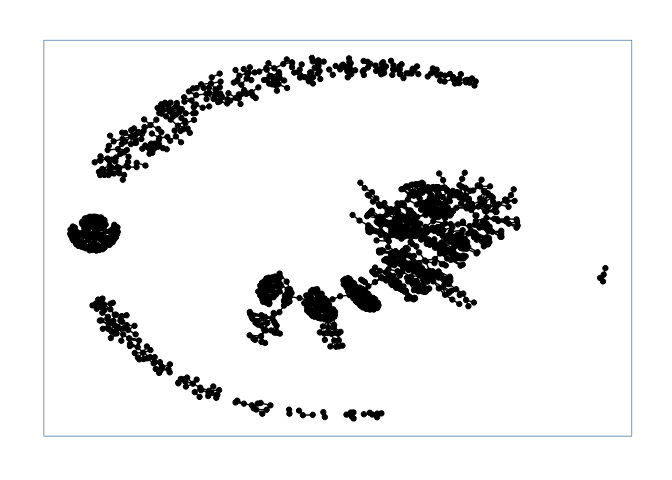

<!-- README.md is generated from README.Rmd. Please edit that file -->

# robsidian

<!-- badges: start -->
<!-- badges: end -->

The goal of robsidian is to …

## Installation

You can install the development version of robsidian from
[GitHub](https://github.com/) with:

``` r
# install.packages("devtools")
devtools::install_github("skvrnami/robsidian")
```

## Example

This is a basic example which shows you how to solve a common problem:

``` r
library(ggraph)
library(robsidian)

vault <- read_vault("~/vault")
```

    #> Loading required package: ggplot2

``` r
head(vault)
#> # A tibble: 6 × 3
#>   doc_id          text                                                 full_path
#>   <chr>           <chr>                                                <chr>    
#> 1 week_2021-11-29 "# 2021-11-29 - 2021-12-05\n\n## What will you be w… /Users/s…
#> 2 week_2021-12-06 "# 2021-12-06 - 2021-12-12\n\n## What will you be w… /Users/s…
#> 3 week_2021-12-13 "# 2021-12-13 - 2021-12-19\n\n## What will you be w… /Users/s…
#> 4 week_2022-01-17 "# 2022-01-17 - 2022-01-23\n## What did you work on… /Users/s…
#> 5 week_2022-01-24 "# 2022-01-24 - 2022-01-30\n## What did you work on… /Users/s…
#> 6 week_2022-01-31 "# 2022-01-31 - 2022-02-06\n### Not all incumbents\… /Users/s…

vault_gph <- create_graph(vault)
ggraph(vault_gph, layout = 'kk') +
    geom_edge_fan(show.legend = FALSE) +
    geom_node_point() +
    theme_graph(foreground = 'steelblue', fg_text_colour = 'white')
#> Warning: Using the `size` aesthetic in this geom was deprecated in ggplot2 3.4.0.
#> ℹ Please use `linewidth` in the `default_aes` field and elsewhere instead.
#> This warning is displayed once every 8 hours.
#> Call `lifecycle::last_lifecycle_warnings()` to see where this warning was
#> generated.
```


